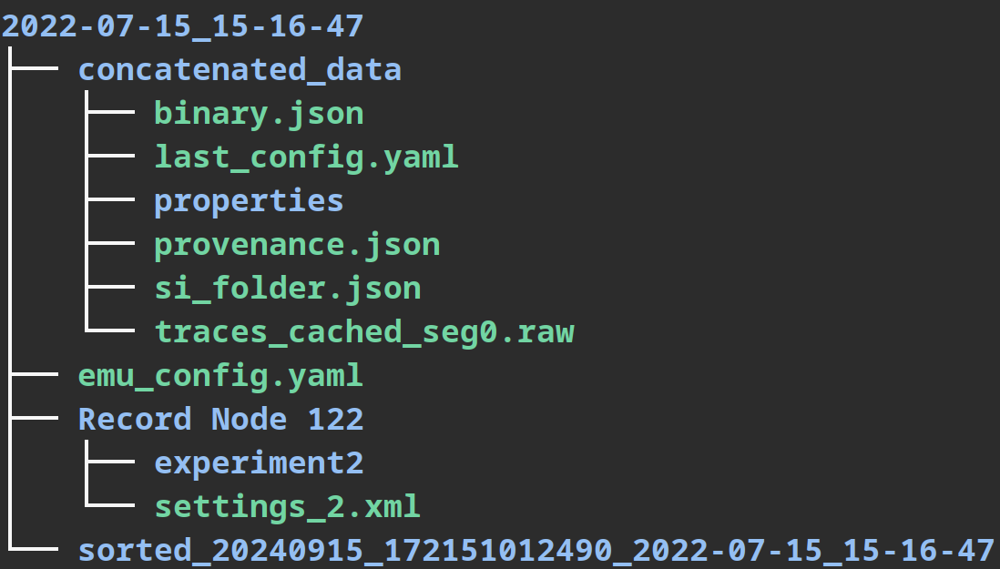

# Enhanced Motor Unit sorter (EMUsort)

### A command line tool for high performance spike sorting of multichannel, single unit electromyography

- Perform spike sorting with a modified version of Kilosort4 specifically tailored to MUAP data for improved performance (see paper for performance comparison results)
- Use a central configuration file to control all parameters and perform parameter sweeps
- Capable of automatically handling Intan, OpenEphys, NWB, Blackrock, and Binary datasets
- Combine recordings into single object for unified processing
- Remove broken or noisy channels automatically
- Export results and easily view in Phy

## Installation

### Requirements

- Currently, using a Linux-based OS is recommended. The code has been tested on Ubuntu. Windows is supported, but may require additional configuration steps as specified below. MacOS is not supported, but might work if it is macOS version >=12.3 and has an Apple silicon or AMD GPU, however, it is untested and tailored instructions are not provided.
- GPUs with compute capability >=5.0 are supported
- Nvidia Driver:
  - Linux: >=450.80.02
  - Windows: >=452.39
- CUDA Toolkit (Automatically installed with the environment):
  - \>=11.3

### Cloning from GitHub

Clone the repository recursively onto your machine (for example, in the home directory)

    git clone --recurse-submodules https://github.com/snel-repo/EMUsort.git

- If you accidentally ran `git clone` without `--recurse-submodules`, just delete the entire `EMUsort` folder and rerun the above command

After cloning is complete, you will need to configure a uv, micromamba, or conda environment.

### Pulling Updates from GitHub

If your cloned repo ever becomes out of date, you should likely pull updates from the main repo. To do so, navigate into the `EMUsort` folder and run:

    git pull && git submodule update

If you are updating and already previously installed EMUsort, you may encounter issues with the configuration file (if it's structure changed). If this happens, you can reset it to the default configuration file by running:

    emusort --folder /path/to/session_folder --reset-config

### Python Environment Creation

Before following the below steps, make sure to navigate into the `EMUsort` folder where you cloned the repo.

#### uv (Option 1, Recommended for Windows and Linux (local system))

Follow the steps and execute the commands below to install and manage EMUsort with [uv](https://docs.astral.sh/uv/), a high performance Python package and project manager:

> **Windows only:** Install [GitBash](https://gitforwindows.org/) first with default settings and use its shell to use EMUsort.

    curl -LsSf https://astral.sh/uv/install.sh | sh

Then either restart the terminal or execute the command suggested in the terminal to enable using `uv` in the terminal. Next, create the environment and install all dependendencies including Phy using `uv`:

    cd /path/to/repo_folder # go into the EMUsort clone location
    uv sync --extra full

If the install finished successfully, proceed to the Usage section next. If you don't want to install Phy, you can use `uv sync --extra core --extra cu118` instead. See `pyproject.toml` for other `--extra` options.

#### Micromamba (Option 2, Recommended for Linux (remote system, e.g., with X11 window manager))

To install micromamba and set up a micromamba environment, follow the steps and execute the commands below:

> **Windows only:** Install [GitBash](https://gitforwindows.org/) first with default settings and use its shell to use EMUsort.

    "${SHELL}" <(curl -L micro.mamba.pm/install.sh)

If this errors out, you can simply download the script from `micro.mamba.pm/install.sh` and run a file with those contents manually with `bash ./install.sh`.
Afterwards, make sure to restart terminal, and use the old version of pyproject.toml stored as pyproject.toml.bak by renaming it back to pyproject.toml:

    cd /path/to/repo_folder # go into the EMUsort clone location
    micromamba env create -f environment.yml

> **Windows only:** During micromamba environment creation, the conda packages usually work, but you may get an error at the end related to the `pip` packages not install installing.
> If this happened, it's likely micromamba worked, but the `pip` packages need manual installation. This is a Windows problem. So, go ahead and activate the micromamba environment you just created (`micromamba activate emusort`), and run the following, one by one:
> `pip install -e ./src/emusort/spikeinterface`
> `pip install -e ./src/emusort/Kilosort4`
> `pip install "git+https://github.com/cortex-lab/phy.git@7a2494b"`
> `pip install -e .`
> If you encounter errors installing spikeinterface or Kilosort4, try navigating into each submodule folder and running `pip install -e .` to install the packages manually. Then `pip install -e .` in the main folder again to install the main EMUsort package.

If the install finished successfully, proceed to the Usage section next.

#### Conda Environment (Option 3, Not Recommended)

To install miniconda, follow these instructions, making sure to select the option for your OS:

- https://docs.anaconda.com/miniconda/#quick-command-line-install

> **Windows only:** Open Anaconda Prompt from the Start Menu, and proceed with the below commands

Run the below commands in the conda-initialized terminal:

    cd /path/to/repo_folder # go into the EMUsort clone location
    conda env create -f environment.yml

## Usage

### Python Environment Activation

Every time you open a new terminal, you must activate the environment, whether manually or automatically (see Advanced Usage for automatic activation).

**uv:** activate the environment using

> *Windows:* `source /path/to/repo_folder/.venv/Scripts/activate` # environment is stored in EMUsort clone location

>*Linux/Mac:* `source /path/to/repo_folder/.venv/bin/activate` # environment is stored in EMUsort clone location

**micromamba:** activate the environment using

    micromamba activate emusort

**anaconda:** activate the environment using

    conda activate emusort

### Session Folder Structure

EMUsort relies on a main "session folder", which contains the below 4 items.

- For Intan, NWB, Blackrock, or Binary datasets, all you need to do is create a new session folder to contain your desired dataset files (Item #1 below). Note that nested folders are fine but use the leaf folder.
- For Open Ephys, the session folder itself (dated folder containing 'Record Node ###') will act as the session folder. The original dataset files will not be modified.

Items #2-4, will be generated automatically inside the provided session folder.

1. Data files (several dataset formats are supported)
   - Intan RHD/RHS files
   - NWB files
   - Blackrock files
   - Binary recording files
   - Record Node ### (if using OpenEphys session folder)
2. `emu_config.yaml` file
   - will be automatically generated and should be updated to make operational changes to EMUsort using the `--config` (or `-c`) command-line option. Within the config file, please note that you will have to change the `dataset_type` attribute to match your desired dataset type. Once you generate the default config template, please review it and utilize the comments as documentation to guide your actions
3. `sorted_yyyyMMdd_HHmmssffffff_g#_<session_folder>_Th#_spkTh#` folders (tagged with datetime stamp, group ID, session folder name, and parameters used)
   - Each time a sort is performed, a new folder will be created in the session folder with the date and time of the sort. Inside this sorted folder will be the sorted data, the phy output files, and a copy of the parameters used to sort the data (`ops.npy` includes channel delays under `ops['preprocessing']['chan_delays']`). The corresponding channel indexes for each sort are saved as `emg_chans_used.npy`. In each new sort folder, the `emu_config.yaml` is also dumped for future reference, which also includes channel indexes used in each sort as `emg_chans_used`.
4. `concatenated_data` folder
   - will be automatically created if the `emg_recordings` field has more than one entry, such as `[0,1,2,7]` or `[all]`, which automatically includes all recordings in the session folder

### Example Folder Tree

#### Intan, NWB, Blackrock, and Binary datasets:

#### Open Ephys datasets:

### EMUsort Commands

To show a helpful summary of EMUsort commands:

    emusort --help

To simply generate a config file (if it doesn't exist), navigate into the `EMUsort` repo folder and run (absolute/relative paths are both acceptable):

    emusort --folder /path/to/session_folder

Editing the main configuration file can be done by running the command below (will be generated if it doesn't exist):

    emusort --folder /path/to/session_folder --config

To run a sort on the dataset(s) in the session folder, run:

    emusort --folder /path/to/session_folder --sort

If a problem occurs with your `emu_config.py` file and you would like to reset to the default, run:

    emusort --folder /path/to/session_folder --reset-config

To perform multiple operations in sequence, you can append any combination of the below commands to the command-line after `emusort`

    --folder, -f
    --config, -c
    --sort, -s
    --reset-config, --r
    --ks4-reset-config, --k

For example, if you want to reset to default config, configure it, and then spike sort immediately, you can run all commands at once with: `emusort -f /path/to/session_folder -cs --r` or simply `emusort --r -csf .` if you are already in the session folder. The flags can be in any order, but the path must always follow directly after the `-f` flag.

### Inspecting and Curating with `phy`

To view and analyze the latest sort with Phy GUI, navigate into the `sorted_###` folder, and run:

    phy template-gui params.py

For more information on `phy`, see documentation at the main repo: [https://phy.readthedocs.io/en/latest/]([url](https://phy.readthedocs.io/en/latest/))

## Advanced Usage

### Automatically Activate the Environment

To automatically activate the environment each time you open a new terminal, append to the end of your `~/.bashrc` file the activation command, depending on which environment manager you are using, execute:

>**Windows**: If using GitBash (recommended), you may need to replace `~/.bashrc` with `~/.bash_profile` in the below commands

**uv:** 
    
    echo "source /path/to/repo_folder/.venv/bin/activate" >> ~/.bashrc # BE SURE TO ENTER THE REAL PATH

**micromamba:**
    
    echo "micromamba activate emusort" >> ~/.bashrc

**conda:**
    
    echo "conda activate emusort" >> ~/.bashrc

### Grid Search Over Multiple Kilosort Parameters to Produce Many Sorts in Parallel

If you want to run multiple sort jobs in parallel across a range of KS parameters, edit `emu_config.py` under the `Sorting` section and set the `do_KS_param_gridsearch` field to `true`. Above it, modify `GPU_to_use` to include all the GPUs that should be used. Modify `num_KS_jobs` to specify how many total jobs to distribute across all chosen GPUs.

Be aware of the combinatorics so you don't generate more sorts than you expected (e.g., NxM combinations for N of param1 and M of param2).

### Running EMUsort As If Default Kilosort4 (v4.0.11)

In order to run EMUsort exactly like a default Kilosort4 (v4.0.11) installation for comparison of performance, you can use `emusort --k -csf .` or the below command:

    emusort --folder /path/to/session_folder --ks4-reset-config --config --sort

This will generate a default ks4 config file and run the sort with it. It does not interfere with the main `emu_config.yaml` file because it is a separate config file named `ks4_config.yaml`. This is useful for comparing the performance of EMUsort vs. Kilosort4.

## Final Notes

If there are any discrepancies in the instructions or any problems with the comments/code, please submit an issue on GitHub so we can try to address the issue ASAP.

Thank you for trying out EMUsort! If you find it helpful, enjoy it, or love emus, give us a ⭐️ on GitHub!
